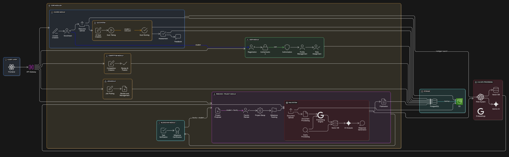
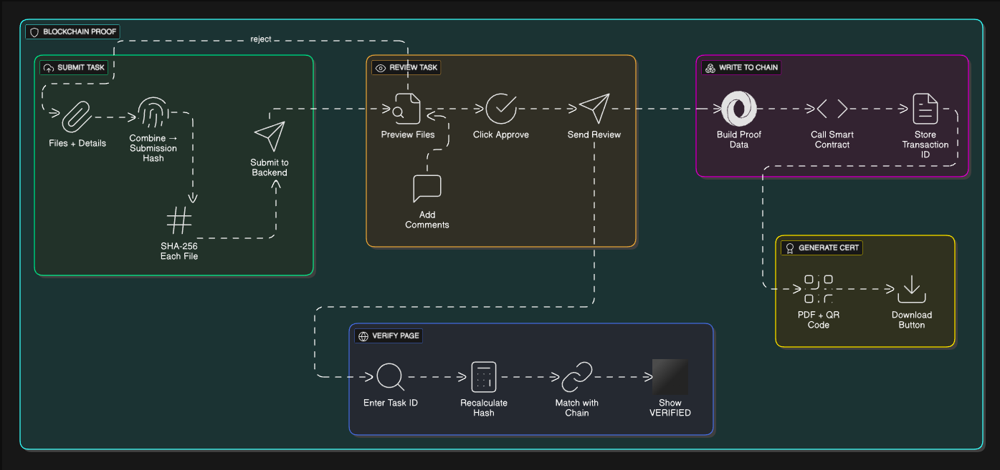
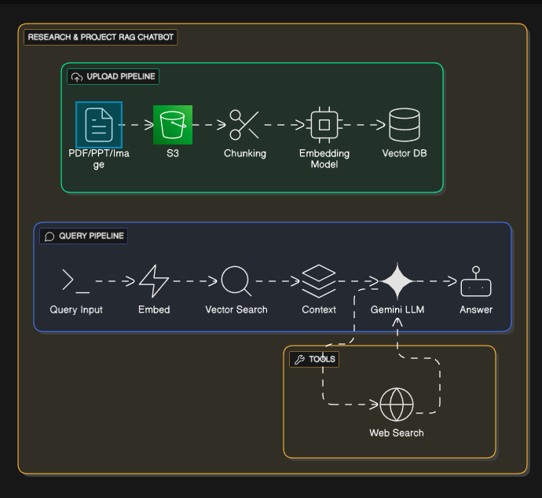
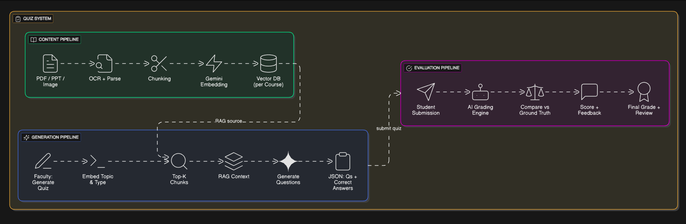

# CPN-AI — Campus Projects & Proof Network

Short project description

CPN-AI (Campus Projects & Proof Network) is an AI-enhanced academic management platform that helps institutions manage semester-based courses, projects, research activities, and achievement verification. It combines Retrieval-Augmented Generation (RAG) for research and content assistance, a recommendation engine for opportunities, and cryptographic proofing for immutable verification of academic milestones and submissions.

Key highlights

- Role-based authentication and department-scoped user management
- Semester-based course and project lifecycle management
- RAG-based AI assistant for research, content generation, and meeting summarization
- Blockchain-verified proof records for submissions and milestones
- Personalized recommendation engine for jobs, competitions, and higher-study opportunities

## Diagrams

Below are the primary architecture and flow diagrams for CPN-AI:

[View Entity Relationship Diagram](resources/cpn-entity-relationship-diagram.png)

- End-to-End (ETE) flow



- Blockchain verification flow



- Research & Chatbot architecture



- Quiz generation & evaluation



## Resources

The project includes supporting documentation and design artifacts in the `resources/` folder. Quick references and diagrams:

- Project Flow: `resources/Project-Flow.md` — full project overview, core features, architecture, and data-flows (RAG, verification, recommendation engines).
- API Documentation: [Click here to open API docs](resources/API_DOCUMENTATION.md) — backend API details and endpoints (also mirrored under `resources/API_DOCUMENTATION.md`).

Useful diagrams (in `resources/`):

- `cpn-entity-relationship-diagram.png` — conceptual ERD for projects, users, milestones, proofs.
- `cpn-ete-diagram.png` — end-to-end (ETE) flow of the platform lifecycle.
- `block-chain-data-flow-diagram.png` — verification & blockchain proof flow.
- `quiz-gen-eval-diagram.png` — quiz generation and evaluation flow used by RAG/AI assistant.
- `researchandproject-chatbot-diagram.png` — architecture of the research/project chatbot assistant.

Refer to `server/src/data/docs/ER_DIAGRAM.md` for a detailed mermaid ER diagram and schema overview used by the backend.

## Quick Start Guide

This guide gets the app running locally (client + server). The repository uses pnpm as the package manager (pnpm is recommended but npm/yarn can be used as alternatives).

Prerequisites

- Node.js (v18+ recommended)
- pnpm (or npm/yarn)

Install dependencies

- Install root tools (optional):

```bash
# from repository root
pnpm install
```

- Install client dependencies and start the frontend:

```bash
cd client
pnpm install
pnpm dev
```

The client runs using Next.js (script `dev` -> `next dev --turbopack`).

- Install server dependencies and start the backend:

```bash
cd server
pnpm install
pnpm dev
```

The server dev script uses `node --import=tsx --watch src/index.ts` (see `server/package.json`). To run a production-like server use `pnpm start` in `server`.

Environment

- Create a `.env` file in the `server/` and `client/` folders as needed. See `server/src/config/env.ts` and `client/src/config/env.ts` for expected variables. Typical variables include database URL, JWT secret, 3rd-party API keys (OpenAI, Pinecone/Pinecone keys, S3 credentials), and frontend NEXT*PUBLIC*\* variables for API base URL.

Database and migrations

- The backend uses Drizzle ORM. Useful commands (from `server`):

```bash
pnpm run db:generate   # generate drizzle migrations
pnpm run db:migrate    # apply migrations
pnpm run db:studio     # open drizzle studio
pnpm run db:push       # push schema
```

Where to look next

- Frontend: `client/src/` — Next.js app, components, hooks, and configuration.
- Backend: `server/src/` — controllers, routes, middleware, and Drizzle schema.
- API endpoints: see `resources/API_DOCUMENTATION.md` for documented endpoints, or inspect `server/src/routes/` and `server/src/controllers/`.

Getting help

If you encounter issues during development, check our troubleshooting docs (if available) or open an issue describing the problem, OS, Node version, and steps to reproduce.

---
