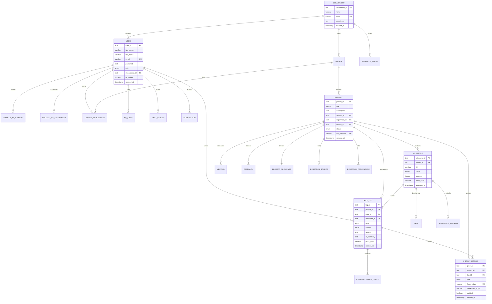
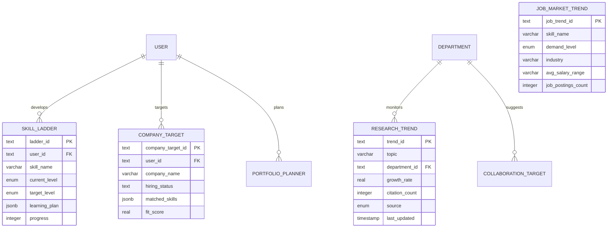
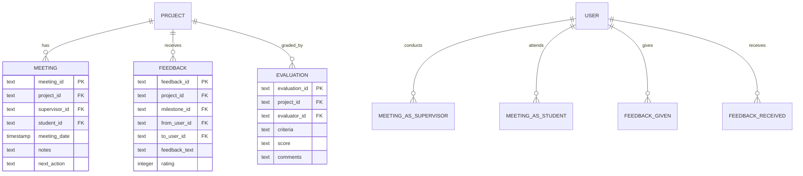
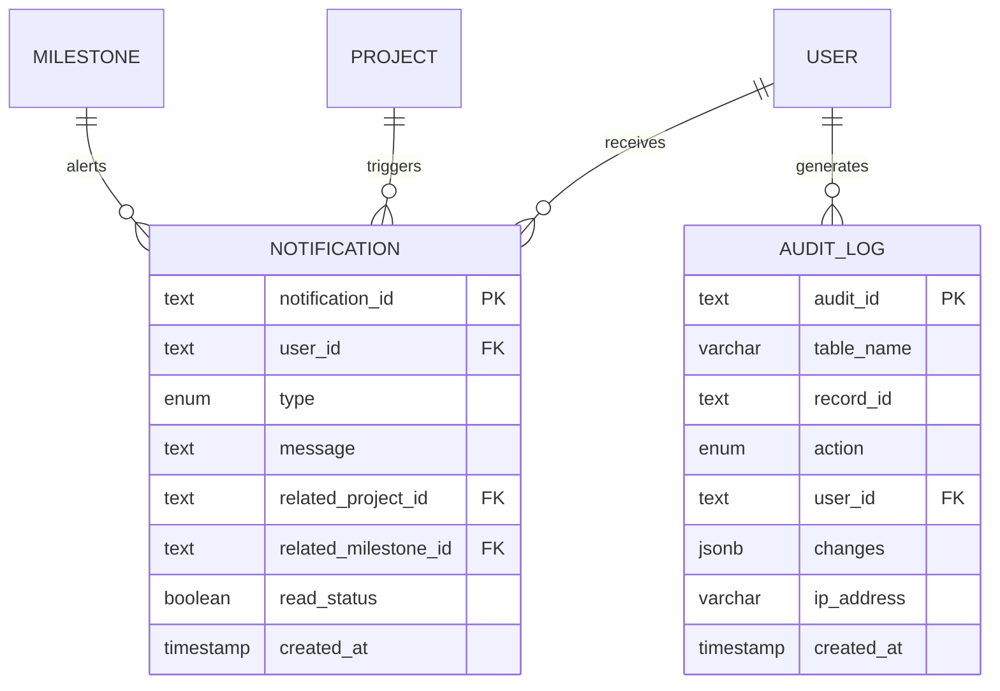
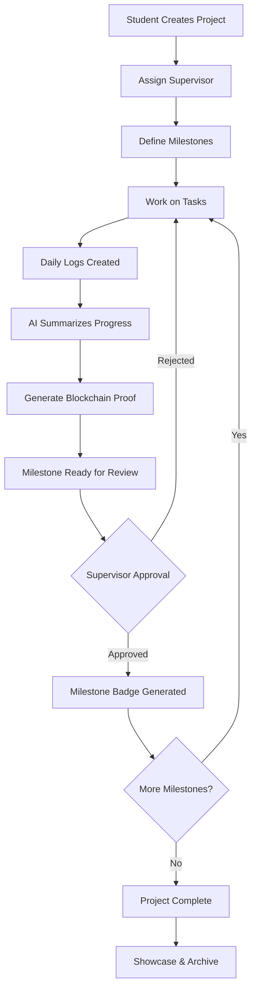
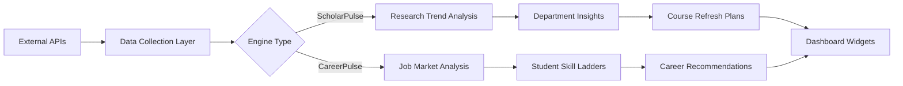
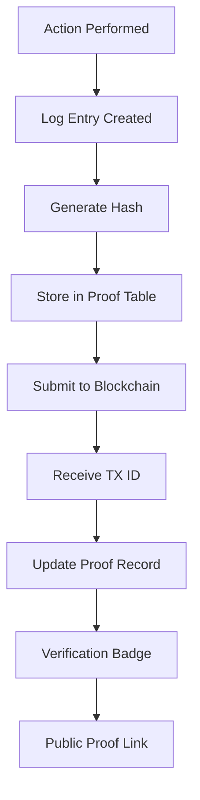
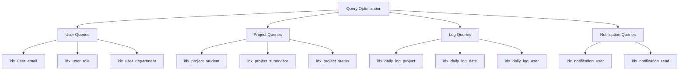

# CPN-AI Database Entity-Relationship Diagram

## Main Entity Relationships



## TwinPulse Engines Schema



## Supervision & Collaboration Schema



## Discovery & Showcase Schema

```mermaid
erDiagram
    PROJECT ||--|| PROJECT_SHOWCASE : "featured_in"
    PROJECT ||--o{ DEPARTMENT_ARCHIVE : "archived_in"
    PROJECT ||--o{ CAMPUS_FEED : "publicizes"

    DEPARTMENT ||--o{ DEPARTMENT_ARCHIVE : "maintains"

    PROJECT_SHOWCASE {
        text showcase_id PK
        text project_id FK UK
        boolean featured
        integer views_count
        integer likes_count
        text abstract
        jsonb key_figures
        timestamp published_at
    }

    DEPARTMENT_ARCHIVE {
        text archive_id PK
        text department_id FK
        text project_id FK
        integer year
        varchar semester
        text[] tags
    }

    CAMPUS_FEED {
        text feed_id PK
        text project_id FK
        text user_id FK
        varchar event_type
        varchar title
        text description
        boolean is_public
    }
```

## System Management Schema



## Data Flow Diagrams

### Project Lifecycle Flow



### TwinPulse Data Processing



### Verification Flow



---

## Database Indexes Visualization

### Critical Performance Indexes



---

## Table Cardinality Summary

| Relationship                 | Cardinality | Notes                         |
| ---------------------------- | ----------- | ----------------------------- |
| User → Projects (Student)    | 1:N         | One student, many projects    |
| User → Projects (Supervisor) | 1:N         | One supervisor, many projects |
| Project → Milestones         | 1:N         | Ordered phases                |
| Milestone → Tasks            | 1:N         | Breakdown of work             |
| Project → Daily Logs         | 1:N         | Activity history              |
| Daily Log → Proof Records    | 1:N         | Verification chain            |
| Project → Showcase           | 1:1         | Optional display              |
| Department → Research Trends | 1:N         | Monitoring topics             |
| User → Skill Ladders         | 1:N         | Learning paths                |

---

## View Diagram in Tools

### Online Mermaid Editors

- [Mermaid Live Editor](https://mermaid.live/)
- [Mermaid Chart](https://www.mermaidchart.com/)

### VS Code Extensions

- Markdown Preview Mermaid Support
- Mermaid Markdown Syntax Highlighting

### Export Options

```bash
# Install mermaid CLI
npm install -g @mermaid-js/mermaid-cli

# Generate PNG
mmdc -i ER_DIAGRAM.md -o er-diagram.png

# Generate SVG
mmdc -i ER_DIAGRAM.md -o er-diagram.svg -t neutral
```

---

**Last Updated:** 2025-11-02
**Diagram Version:** 1.0.0
